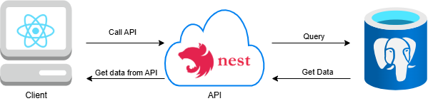
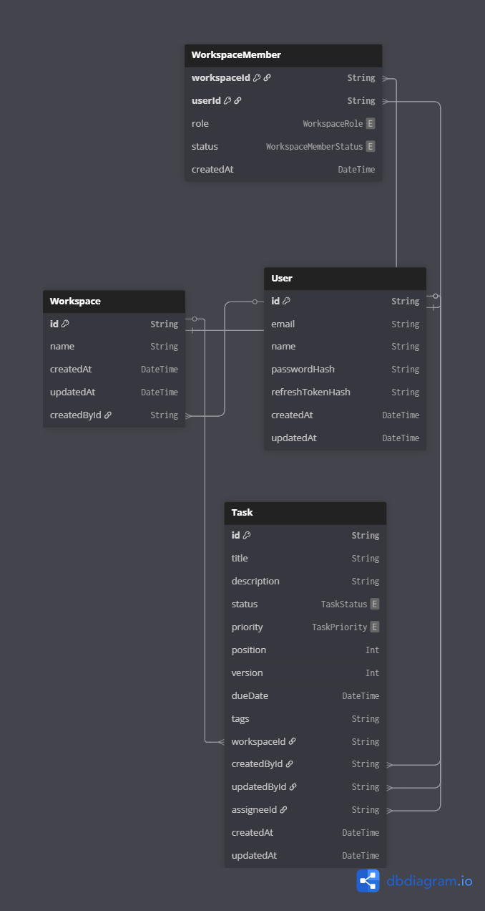
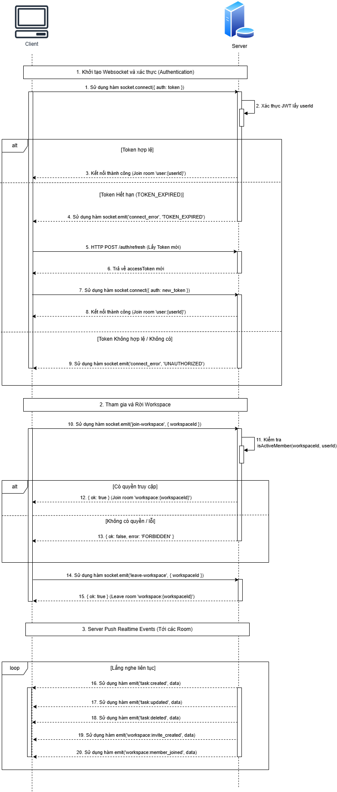

# Realtime Task Collaboration System

A real-time task management board for small teams — a lightweight Trello alternative. Multiple users can join a shared workspace and collaborate on tasks with instant updates across all connected clients.

## Tech Stack

| Layer | Technology |
|---|---|
| Backend | NestJS, REST API, WebSocket (Socket.IO) |
| Database | PostgreSQL, Prisma ORM |
| Frontend | React, TypeScript, Zustand, Socket.IO Client, Ant Design |
| Auth | JWT (Access Token) |
| Infrastructure | Docker, Docker Compose |

---

## System Architecture



### Frontend Layer Responsibilities

- **React UI** — renders components, reacts to Zustand state changes only
- **Axios layer** — all HTTP requests; never touches UI components directly
- **Socket.IO client** — listens for server events and hydrates Zustand stores
- **Zustand** — single source of truth for tasks, workspaces, and auth state

### Backend Layer Responsibilities

- **REST Controllers** — handle CRUD operations for auth, workspaces, and tasks
- **WebSocket Gateway** — manages Socket.IO connections; enforces room-based isolation per workspace
- **Guards** — validate JWT on both HTTP and WebSocket connections
- **Services** — business logic, shared between REST and WebSocket layers

---

## Database Schema



---

## Realtime Flow Diagram



### Room Isolation & Security

Each workspace maps to a dedicated Socket.IO room (`workspaceId`). When a client connects, the server validates the JWT and calls `socket.join()` only for workspaces the user belongs to. Events are emitted exclusively to the target room — preventing cross-workspace data leakage.

---

## REST API Endpoints

### Auth
| Method | Endpoint | Description |
|---|---|---|
| POST | `/auth/register` | Register a new user |
| POST | `/auth/login` | Login and receive JWT |

### Workspaces
| Method | Endpoint | Description |
|---|---|---|
| GET | `/workspaces` | List user's workspaces |
| POST | `/workspaces` | Create a workspace |
| POST | `/workspaces/:id/invite` | Invite a user by email |

### Tasks
| Method | Endpoint | Description |
|---|---|---|
| GET | `/workspaces/:id/tasks` | List tasks in a workspace |
| POST | `/workspaces/:id/tasks` | Create a task |
| PATCH | `/workspaces/:id/tasks/:taskId` | Update task (title, status) |
| DELETE | `/workspaces/:id/tasks/:taskId` | Delete a task |

---

## WebSocket Events

### Client → Server
| Event | Payload | Description |
|---|---|---|
| `workspace:join` | `{ workspaceId }` | Explicitly join a workspace room |

### Server → Client
| Event | Payload | Description |
|---|---|---|
| `task:created` | `Task` | A new task was created |
| `task:updated` | `Task` | A task was updated |
| `task:deleted` | `{ taskId }` | A task was deleted |

---

## Special Case Handling

| Scenario | Strategy |
|---|---|
| Multiple browser tabs | All tabs share the same socket connection or each joins the same room; Zustand sync ensures consistent UI |
| Simultaneous task edits | Last-write-wins via `updatedAt` timestamp; server rebroadcasts the authoritative state |
| JWT expires during WebSocket session | Client detects 401 on next REST call, refreshes token, reconnects socket with new token |
| Network disconnect / reconnect | Socket.IO auto-reconnect; client re-joins workspace rooms on `connect` event |
| Duplicate events | Events carry a unique `taskId`; Zustand updates by ID (upsert), preventing duplicates |
| Cross-workspace event leakage | Server enforces room-based emit; membership validated on every event |

---

## Project Structure

```
/
├── BE/                  # NestJS backend
│   ├── src/
│   │   ├── auth/
│   │   ├── workspace/
│   │   ├── task/
│   │   ├── gateway/     # Socket.IO WebSocket gateway
│   │   └── prisma/
│   ├── prisma/
│   │   └── schema.prisma
│   └── docker-compose.yml
│
├── FE/                  # React + TypeScript frontend
│   ├── src/
│   │   ├── api/         # Axios wrappers
│   │   ├── socket/      # Socket.IO client & event handlers
│   │   ├── store/       # Zustand stores
│   │   ├── pages/
│   │   └── components/
│   └── .env
│
└── README.md            # This file
```

---

## Running the Project

### Prerequisites

- Node.js >= 16.x
- npm >= 7.x
- Docker & Docker Compose

### 1. Start the Backend

```bash
cd BE
npm install
docker-compose up -d        # Start PostgreSQL
npm run db:push             # Apply Prisma schema
npm run db:seed             # Seed initial data (optional)
npm run start:dev           # Start NestJS dev server → http://localhost:3000
```

### 2. Start the Frontend

```bash
cd FE
npm install
# Create .env with: VITE_API_BASE_URL=http://localhost:3000
npm run dev                 # Start Vite dev server → http://localhost:5173
```

### 3. Open the App

Navigate to `http://localhost:5173` in your browser.

---

## Security Considerations

- All REST endpoints are protected by a JWT `AuthGuard`
- WebSocket connections require a valid JWT passed in the handshake `auth` field
- Workspace membership is validated on every request and every socket event
- Users only receive realtime events for workspaces they belong to
- Passwords are hashed with bcrypt before storage